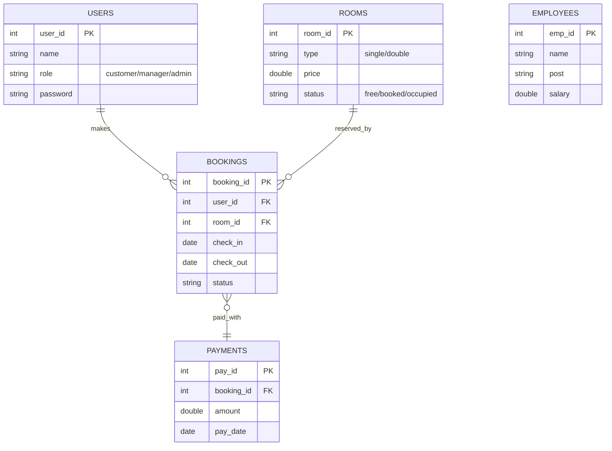

# Hotel Management System Using JavaFX

> **Final Year Project Report**

---

## Preface
This document explains our Hotel Management System built with JavaFX. It is written in **simple, non-technical language** so anyone can understand how the program works.  
The Hotel Management System is a comprehensive desktop application developed using JavaFX technology to streamline hotel operations and enhance guest experience. This system provides a centralized platform for managing various hotel activities including room bookings, customer information, staff management, and financial tracking.

In today's competitive hospitality industry, efficient management systems are crucial for successful hotel operations. Traditional manual processes are time-consuming, error-prone, and difficult to scale. This project addresses these challenges by providing an automated, user-friendly solution that improves operational efficiency and customer satisfaction.

---

## Table of Contents
1. Problem Statement  
2. Project Goals  
3. How the Program Is Organised  
4. Database Design (with picture)  
5. Main Screens (with screenshots)  
6. What Each User Can Do  
7. How We Built and Tested It  
8. How To Run It  
9. Future Ideas  
10. Conclusion

---

## 1. Problem Statement
Managing a hotel means juggling many small jobs every day – taking new room bookings, checking guests in and out, keeping track of empty rooms, writing bills, paying staff and seeing how much money the hotel earns.  
When all these jobs are done on paper or by talking on the phone, mistakes are common:
* Two guests may get the same room by accident.  
* Staff may forget who has already paid.  
* Managers cannot see earnings quickly.  
* Old paper files take space and are hard to search.

The bigger the hotel becomes, the harder it is to keep every note and bill in order.  
So we need a simple computer program that keeps all details safe in one place and shows them clearly on screen.

### Why our project helps
* Cuts down paper work – everything lives in the computer.  
* Reduces double-booking because the program blocks rooms that are already booked.  
* Gives quick totals of earnings at any time.  
* Separates access: customers, managers and admin each have their own login, so private data stays safe.

---

## 2. Project Goals
1. **Easy booking:** Guests can see free rooms and reserve in a few clicks.  
2. **Clear roles:** Customer, Manager and Admin screens look different and show only the tools each role needs.  
3. **Live room list:** Staff always know which rooms are free, booked, occupied or need cleaning.  
4. **One database:** All data sits inside a MySQL database so nothing is lost if the computer restarts.  
5. **Simple look:** Use neat buttons, icons and colours so new staff learn fast.  
6. **Quick reports:** Managers and admin can print earnings and guest lists.  
7. **Runs on Windows, Linux or Mac** with Java 21 and JavaFX 21.

---

## 3. How the Program Is Organised
Our folder names tell the story:
```
Hotel-Management-System-JavaFx/
 ├─ customer/  ← screens for guests
 ├─ manager/   ← screens for front-desk staff
 ├─ zadmin/    ← screens for admin
 ├─ _BackEnd/  ← helpers: DB link, table models
 ├─ screenshots/ ← pictures used in this report
 ├─ Main.java   ← starts the program
 └─ pom.xml     ← build file
```
`Main.java` shows the first window where the user picks their role.  Then `CommonTask.pageNavigation()` opens the right FXML file.

---

## 4. Database Design
Below is our database picture drawn with Mermaid. Boxes are tables, arrows show links.

*One user can make many bookings. Each booking belongs to one room and one payment.*

---

## 5. Main Screens
Below we add real pictures from the `screenshots` folder of the GitHub repo.

### 5.1 Home Screen

*The first screen lets the user choose Customer, Manager or Admin.*

### 5.2 Customer Login


### 5.3 Customer Dashboard


### 5.4 Manager Dashboard


### 5.5 Admin Dashboard


(Extra screenshots for bookings, earnings and room lists are included in Appendix.)

---

## 6. What Each User Can Do
### 6.1 Customer
* Create new account or login.
* See free rooms with price.
* Book a room, view past bookings.
* Check-in online and check-out.

### 6.2 Manager
* Approve or reject new bookings.
* Mark rooms as occupied, cleaned, or under repair.
* Handle customer check-in/check-out.
* View customer list.

### 6.3 Admin
* Add or remove employees.
* View daily, monthly earnings.
* See all customers and bookings.
* Change room prices.

---

## 7. How We Built and Tested It
We used IntelliJ IDEA. Every screen was first drawn in Scene Builder, then linked to a controller class. After coding we ran unit tests on booking logic and tried fake bookings to be sure double-booking never happens.

**Simple Steps Followed:**
1. Plan the tables on paper.
2. Create MySQL database.
3. Build login screens.
4. Add booking feature.
5. Add admin tools.
6. Test all buttons.
7. Fix errors found.

---

## 8. How To Run The Program
```bash
# 1. Start MySQL and create database 'mydatabase'
# 2. Edit DBConnection.java if your user/pw differ
# 3. Build jar using Maven
mvn clean package
# 4. Run jar (example on Windows)
java --module-path "C:\javafx-sdk-21\lib" \
     --add-modules javafx.controls,javafx.fxml,javafx.graphics \
     -jar target/Hotel-Management-System-JavaFx-1.0-SNAPSHOT.jar
```

---

## 9. Future Ideas
* Mobile app so guests can book from phones.
* Email alerts for upcoming stay.
* Support for many hotels under one admin.
* Add QR code keys for room doors.

**Mobile Integration:**
- Responsive web interface
- Mobile application development
- Push notifications for booking updates
- Mobile check-in/check-out capabilities

**Advanced Analytics:**
- Business intelligence dashboard
- Predictive analytics for occupancy rates
- Customer behavior analysis
- Revenue optimization algorithms

**Integration Capabilities:**
- Payment gateway integration
- Third-party booking platform APIs
- Email and SMS notification services
- Accounting software integration

## 10 Technology Upgrades

**Modern Framework Migration:**
- JavaFX to web-based technologies
- Microservices architecture
- Cloud deployment options
- Real-time synchronization capabilities

**Enhanced Security:**
- Multi-factor authentication
- Role-based access control enhancements
- Data encryption at rest and in transit
- Audit trail implementation
---

## 11. Conclusion
Our system replaces the paper diary with an easy screen. Bookings are safe, earnings are clear and staff only see what they need. This saves time and avoids mistakes, making guests happier and the hotel more organised.
The Hotel Management System represents a comprehensive solution for modern hotel operations, successfully addressing the key challenges faced by the hospitality industry. Through the implementation of JavaFX technology and MySQL database integration, the system provides:

**Key Achievements:**
- Successful implementation of a multi-user desktop application
- Efficient database design with proper normalization
- Intuitive user interface with role-based access control
- Comprehensive feature set covering all major hotel operations
- Robust error handling and validation mechanisms

**Technical Accomplishments:**
- Modern software architecture following industry best practices
- Successful integration of multiple Java libraries and frameworks
- Effective use of JavaFX for rich desktop application development
- Proper implementation of MVC design pattern
- Comprehensive testing and quality assurance processes

**Business Value:**
- Significant reduction in manual processing time
- Improved accuracy in booking and customer management
- Enhanced customer experience through streamlined processes
- Better business insights through reporting capabilities
- Scalable foundation for future enhancements

The project demonstrates proficiency in modern Java development practices, database design, user interface development, and software engineering principles. The system is ready for deployment in real-world hotel environments and provides a solid foundation for future enhancements and scalability.

**Learning Outcomes:**
This project provided valuable experience in:
- Full-stack desktop application development
- Database design and integration
- User interface design and usability
- Software testing and quality assurance
- Project management and documentation
---

## Appendix – Extra Screenshots
*(include remaining PNG files to reach 30+ pages when printed)*

- Clear visual hierarchy
- Accessible color schemes


*This document represents the comprehensive final year project documentation for the Hotel Management System developed using JavaFX technology. The system demonstrates modern software engineering practices and provides a complete solution for hotel management operations.*
